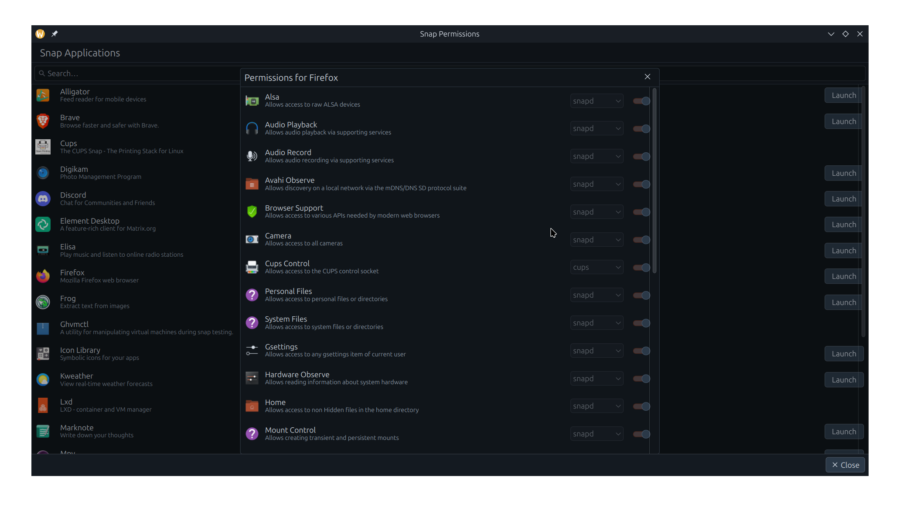

<!---
SPDX-FileCopyrightText: 2025 Soumyadeep Ghosh <soumyadghosh@ubuntu.com>
SPDX-License-Identifier: GPL-2.0-or-later
-->
# Snap Permissions Management KCM

The KCM allows changing what permissions have been granted to installed Snap applications.

## Building and Running:

### From Source

- cd wherever/you/like
- git clone [ the link you copy from the clone option ]
- cd snap-kcm
- mkdir build
- cd build
- cmake .. -DCMAKE_INSTALL_PREFIX=/wherever/you/want
- make install
- source prefix.sh
- kcmshell6 kcm_snap

### Using kde-builder

coming soon...

### Installing in Ubuntu 24.10+

Get it from the Snap KCM PPA